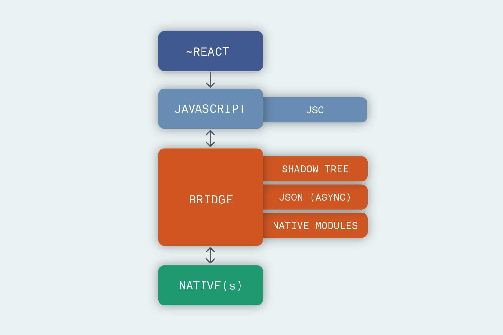
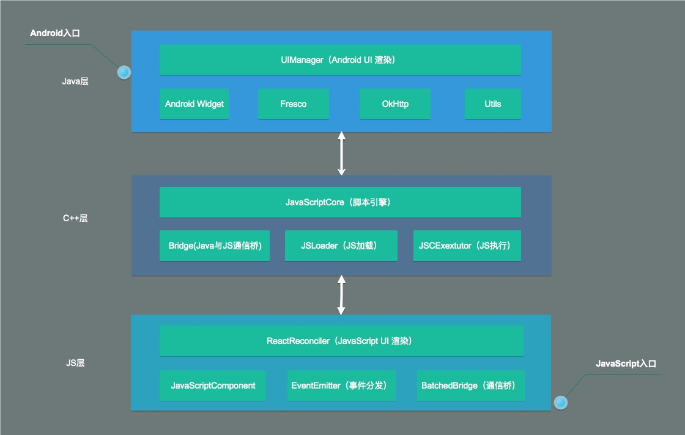
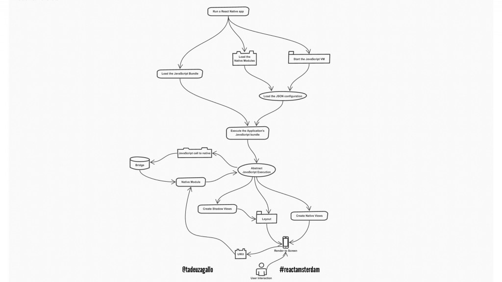
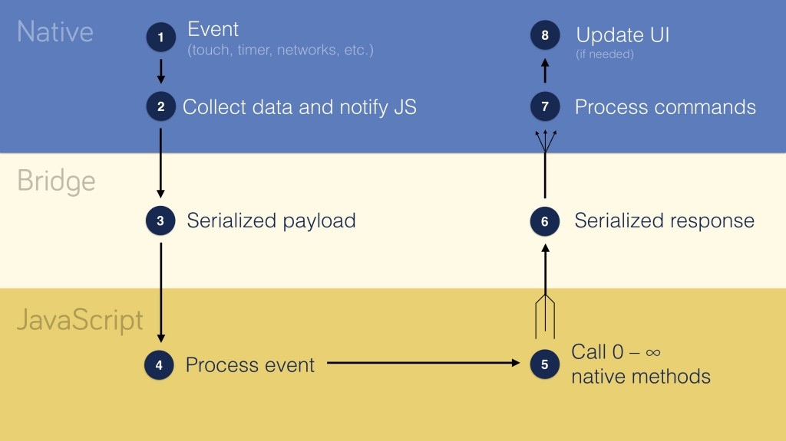
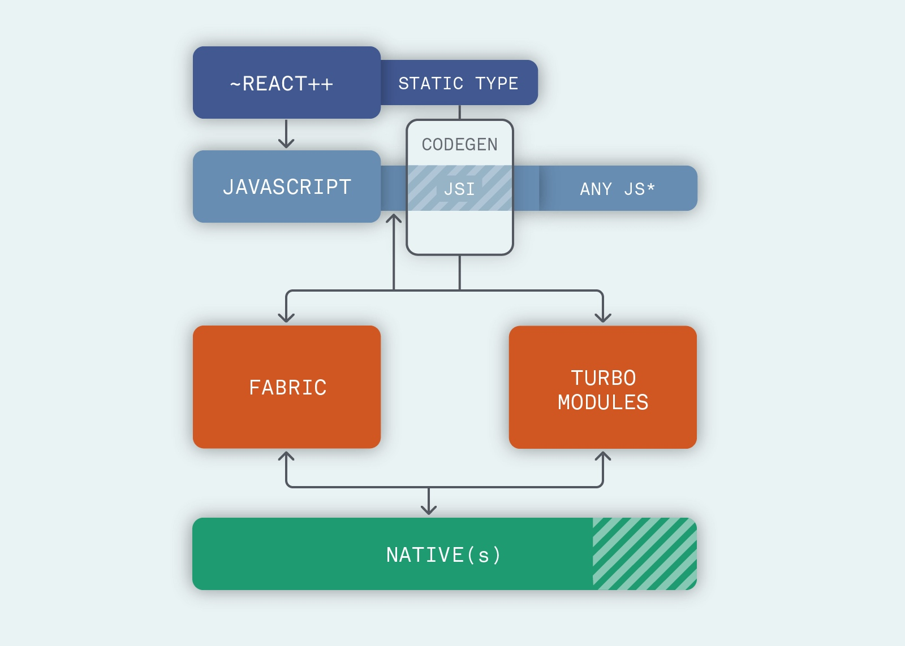

---

tags: 
- RN
categories:
- [ReactNative]

---

## ReactNative 发展历史

### 起源
React Native 想法来源于2013年的 Facebook 内部黑客马拉松（hackathon）
[React Native: A year in review](https://engineering.fb.com/android/react-native-bringing-modern-web-techniques-to-mobile/)

>In the beginning: React Native’s roots
In the essence of Facebook’s hacker culture, React Native started as a hackathon project in the summer of 2013. Similar to React, React Native seemed like a boldly unconventional idea. It wasn’t clear this would actually work. How was touch negotiation between JS and native ScrollViews going to work? What about performance, and what about debugging? None of these challenges stopped the engineers from focusing and pushing forward.

[React Native: Bringing modern web techniques to mobile](https://engineering.fb.com/android/react-native-bringing-modern-web-techniques-to-mobile/)

随着React的快速发展，Facebook越发感受到 React 以及 Web 技术的优势，同时Native在““Move fast” 这一块的糟糕表现，所以就引发了将Web先进技术引进Native的开发，

* 快速开发（Rapid development velocity）：刷新浏览器即可生效，不必等待重新编译 App
* 快速迭代（Rapid iteration cycle）：Web 一天两版，产品迭代周期更短
* 快速反馈（Immediate testing feedback）：Web 发布立即触达用户，A/B test 等实验结果立等可取，产品演进更快

为了实现这个目标，FaceBook尝试过三种方案

1. Using WebViews ，通过Native提供容器，使用Web进行开发。这样能全面利用Web的开发经验并且具备WEB技术的一样可扩展性，但最终渲染性能并不理想，而且因为全部是Web技术开发也没有沉淀很好的Native技术
2. Porting React to native，把React移植到native实现，15年推出了iOS [componentkit](https://github.com/facebook/componentkit) 以及在17年推出了Android [Litho](https://github.com/facebook/litho) 。实现了很多React的特性，例如可预测性UI、声明式。但没有实现提升效率的初衷，仍然需要重新编译。另外需要进行双端适配。而且Web React的生态建设也不能直接复用。
3. Scripting native，通过 JavaScript 调用 Native API。既能拥有 Web 开发的快速迭代能力，还不局限于 Web 技术，同时也没有脱离 JavaScript 生态，似乎是个完美的方案，然而实践并没有那么简单。主要是Native环境和JS环境来回通信，过多的通信承载以及引起的UI线程阻塞都会带来性能损害。 但最终幸运的是React整体的技术模型仍然可以向着正确的方向演进

### 发展
#### 2015
* February 18, 2015 : [React.js Conf Round-up 2015](https://reactjs.org/blog/2015/02/18/react-conf-roundup-2015.html)，首次揭幕FaceBook内部使用技术ReactNative

 > unveil three new technologies that we’ve been using internally at Facebook for some time: GraphQL, Relay, and React Native.
* March 26, 2015： [F8 2015: New Open Source Tools for Mobile Developers](https://about.fb.com/news/2015/03/f8-2015-new-open-source-tools-for-mobile-developers/)，首次发布并开源ReactNative

 > React Native is a framework for native environments that allows developers to build first-class iOS and Android user interfaces with no browser/WebView involved
* MAR 26, 2015: [React Native: Bringing modern web techniques to mobile](https://engineering.fb.com/android/react-native-bringing-modern-web-techniques-to-mobile/)，发布第一篇官方介绍，此时仅支持 iOS
* SEP 14, 2015：[React Native for Android: How we built the first cross-platform React Native app](https://engineering.fb.com/developer-tools/react-native-for-android-how-we-built-the-first-cross-platform-react-native-app/)，宣布 React Native 支持 Android 了，文章中提到两个大的认知，1是iOS和Android独立开发并不可取，最终两端基于一个公共库进行开发；2是初始阶段由于双端未充分的测试带来的成本要高于开发成本，不过这些偶发的问题在不断的技术抹平差异后带来了稳定性的提高

#### 2016

* March 24, 2016：[Introducing Hot Reloading](https://reactnative.dev/blog/2016/03/24/introducing-hot-reloading)，热加载介绍，实现了变更实施可见
* MAR 28, 2016：[Dive into React Native performance
](https://engineering.fb.com/android/dive-into-react-native-performance/)，全面提升性能
    * Cleanup Require/Babel helpers (high impact): 清楚无用引用
    * Avoid copying and decoding strings when loading the bundle (medium impact): 加载bundle避免复制和解码
    * Stripping DEV-only modules (low impact): 支持Dev模块，减少体积从而提升JS转换效率
    * Generate event descriptions on the server (low impact): Data后移，减少客户端处理数据操作
    * Lazy requires (low impact): 按需加载模块
    * Relay incremental cache read (high impact): 提神缓存读取效率
    * De-batching bridge calls, batch Relay calls (high impact): 批处理桥交互操作
    * Early UI flushing (low impact): UI刷新批处理
    * Lazy native modules loading (low impact): 懒加载Native模块
    * Lazy touch bindings on text components (low impact): 懒加载组件
    * Defer popular events query (medium impact): 延期处理屏幕事件
* APRIL 13, 2016 ：[React Native on the Universal Windows Platform](https://blogs.windows.com/windowsdeveloper/2016/04/13/react-native-on-the-universal-windows-platform/)，Windows平台实现
* APR 142016：[Samsung Committed to Bringing React Native to Tizen：进入三星物联网生态（Tizen 系统）](https://www.tizen.org/blogs/srsaul/2016/samsung-committed-bringing-react-native-tizen)进入三星物联网生态（Tizen 系统）
* August 19, 2016：[Making an App RTL-ready](https://reactnative.dev/blog/2016/08/19/right-to-left-support-for-react-native-apps)，支持RTL布局
* October 25, 2016：[0.36: Headless JS, the Keyboard API, & more](https://reactnative.dev/blog/2016/10/25/0.36-headless-js-the-keyboard-api-and-more)，发布0.36版本，Headless支持后台任务、键盘操作等
* November 8, 2016：[Introducing Button, Faster Installs with Yarn, and a Public Roadmap](https://reactnative.dev/blog/2016/11/08/introducing-button-yarn-and-a-public-roadmap)，发布0.37版本，支持Button组件，支持Yarn

#### 2017
* February 14, 2017：[Using Native Driver for Animated](https://reactnative.dev/blog/2017/02/14/using-native-driver-for-animated)，支持Native驱动动画，早期动画实现在JS线程中，这容易因JS线程Block造成动画的跳帧。
* March 13, 2017：[Better List Views in React Native](https://reactnative.dev/blog/2017/03/13/better-list-views)，提供FlatList和SectionList更好的支持列表实现。同时也提到了一些注意事项，譬如非屏幕部分是异步渲染，所以在快速滑动的时候可能会引起白屏。
* March 13, 2017：[Introducing Create React Native App](https://reactnative.dev/blog/2017/03/13/introducing-create-react-native-app)，推出官方脚手架支持App创建
* August 7, 2017：[React Native Performance in Marketplace](https://reactnative.dev/blog/2017/08/07/react-native-performance-in-marketplace)，介绍 Facebook 在其 React Native 主应用（Marketplace）上的性能优化实践，后续计划优化编译时的性能优化探索，如Prepack，期望大幅削减 React Native core 的初始化耗时
  

#### 2018
* January 18, 2018：[Implementing Twitter’s App Loading Animation in React Native](https://reactnative.dev/blog/2018/01/18/implementing-twitters-app-loading-animation-in-react-native)，Twitter动画的一些实践，并且在动画方面有一些成果，Fade、Scale、Hide
* March 22, 2018：[Building <InputAccessoryView> For React Native](https://reactnative.dev/blog/2018/03/22/building-input-accessory-view-for-react-native)，支持 InputAccessoryView组件
* May 7, 2018：[Using TypeScript with React Native](https://reactnative.dev/blog/2018/05/07/using-typescript-with-react-native)，支持TS语言
* June 14, 2018：[State of React Native 2018](https://reactnative.dev/blog/2018/06/14/state-of-react-native-2018)，介绍团队正在对整体架构进行重构升级，旨在使得框架更加轻量和更加监控，主要聚焦三个方面 
    1. 针对高优先级的更新可以在任何线程同步调用JS线程，以及取代每次UI更新需要经历三层线程模型，使得JS线程可以根据。
    2. 合并异步渲染以及简化异步数据处理
    3. 轻量化桥实现，JS和Native之间桥交互性能更高效
* July 4, 2018：[Releasing 0.56](https://reactnative.dev/blog/2018/07/04/releasing-react-native-056)，发布 0.56，升级 Babel、Android SDK、Xcode、Flow 等依赖版本
* November 1, 2018：[Open Source Roadmap](https://reactnative.dev/blog/2018/11/01/oss-roadmap)，计划精简核心模块，并开源 Facebook 内部的一些基建
* January 7, 2019: [The State of the React Native Community in 2018](https://reactnative.dev/blog/2019/01/07/state-of-react-native-community)，说明2018计划更好地支持 Native & React Native 混合 App，核心团队启动了架构升级计划（Fabric），包括重构线程模型、支持 React async rendering 能力、简化 React Native core 等大改。

#### 2019
* March 12, 2019：[Releasing React Native 0.59](https://reactnative.dev/blog/2019/03/12/releasing-react-native-059)，发布0.59
    * Hooks支持
    * JSC更新，和性能提升，以及Android 64位支持
    * inline requires支持，更快app启动性能
    * Lean core is underway，核心模块精简计划持续进行
    * CLI improvements
* March 31, 2019：[Mobile Innovation with React Native, ComponentKit, and Litho](https://www.facebook.com/FacebookforDevelopers/videos/mobile-innovation-with-react-native-componentkit-and-litho/440768533157155/)，分享 Facebook 的移动技术栈（React Native + ComponentKit 和 Litho）
* July 17, 2019：[Meet Hermes, a new JavaScript Engine optimized for React Native](https://reactnative.dev/blog/2019/07/17/hermes) Hermes 引擎发布，Hermes: An open source JavaScript engine optimized for mobile apps, starting with React Native

* July 3, 2019：[Announcing React Native 0.60](https://reactnative.dev/blog/2019/07/03/version-60)，0.60发布，聚焦一些辅助功能提升，AndroidX支持、Native模块自动链接、Helper更新等
* September 18, 2019：[Announcing React Native 0.61 with Fast Refresh](https://reactnative.dev/blog/2019/09/18/version-0.61)，新概念“Fast Flush”，更可靠和更高效的本地更新渲染能力

#### 2020
* March 26, 2020：[Announcing React Native 0.62 with Flipper](https://reactnative.dev/blog/2020/03/26/version-0.62)，发布0.62，提供Flipper，更友好的支持Debug调试

## ReactNative 运行原理
### 系统设计
整体由React、JavaScript、Bridge、Native四层组成，Native负责UI更新及交互处理，JavaScript调用Native能力实现业务功能，Bridge则为两者之间提供通信桥梁

* 最上层提供类 React 支持，运行在JavaScriptCore提供的 JavaScript 运行时环境中
* Bridge 层将 JavaScript 与 Native 环境连接起来，JSON用来传递UI更新信息，Shadow Tree 用来定义 UI 效果及交互功能，Native Modules 提供 Native 功能（比如蓝牙），二者之间通过 JSON 消息相互通信
    * 异步（asynchronous）：不依赖于同步通信
    * 可序列化（serializable）：保证一切 UI 操作都能序列化成 JSON 并转换回来
    * 批处理（batched）：对 Native 调用进行排队，批量处理
* 

**系统分层**

**系统结构（Android）（引用）**

### 线程模型
React Native 中主要有3种线程

* UI Thread：Android/iOS（或其它平台）应用中的主线程
* Shadow Thread：进行布局计算和构造 UI 界面的线程
* JS Thread：React或其它JavaScript 代码都在这个线程执行

此外，还有一类 Native Modules 线程，不同的 Native Module 可以运行在不同的线程中http://chain-react-bridging.surge.sh/dist/96efedea67e784036f946c487a06cdc9.png

**线程工作流程**

**线程交互流程**

### 启动流程
* 启动RN App
* 加载JavaScript VM、JavaScript Bundle、NativeModule
* 执行JavaScript bundle
* native调用、shadow tree创建、布局、NativeView创建
* View渲染

**整体启动流程**

**官方启动时间模块划分**

### 渲染流程
**事件传递**

**首次渲染**

**更新渲染**

### 架构演进

2018 年 6 月启动了架构升级计划 Fabric，重构线程模型并简化 React Native Core，以更好地支持 Native & React Native 混合 App

以前架构问题：

* 异步：无法将 JavaScript 逻辑直接与许多需要同步的 Native API 集成
* 处理：很难让 React Native 应用调用 Native 实现的函数
* 可序列化：存在不必要的 copy，而不是直接共享内存

改进方向

#### React 层
提供 CodeGen 工具来保证消息通信的类型安全，以解决 JavaScript 与 Native 通信中被广为诟病的 Bridge API 数据类型问题
#### JavaScript 层
上层 JavaScript 代码需要一个运行时环境，在 React Native 中这个环境是 JSC（JavaScriptCore）。不同于之前直接将 JavaScript 代码输入给 JSC，新的架构中引入了一层 JSI（JavaScript Interface），作为 JSC 之上的抽象，用来屏蔽 JavaScript 引擎的差异，允许换用不同的 JavaScript 引擎（如Hermes）
#### Bridge 层
划分成 Fabric 和 TurboModules 两部分，分别负责 UI 管理与 Native 模块    

**Fabric** 期望以更现代化的方式去实现 React Native 的渲染层，简化之前渲染流程中复杂跨线程交互（React -> Native -> Shadow Tree -> Native UI）。具体的，直接在 C++层创建 JavaScript 与 Native 共享的 Shadow Tree，并通过 JSI 层将 UI 操作接口暴露给 JavaScript，允许 JavaScript 直接控制高优先级的 UI 操作，甚至允许同步调用（应对列表快速滚动、页面切换、手势处理等场景）

**TurboModules** 之前所有 Native Modules（无论是否需要用到）都要在应用启动时进行初始化，因为 Native 不知道 JavaScript 将会调用哪些功能模块。而新的TurboModules 允许按需加载 Native 模块，并在模块初始化之后直接持有其引用，不再依靠消息通信来调用模块功能。因此，应用的启动时间也会有所提升

#### Native 层
精简核心模块，将非核心部分拆分出去作为社区模块独立更新维护，理论上 React Native 应该是通用的，对平台无感知，这是能够支持Web、Windows等不同平台的关键
虽然 Native 不在 React Native 的掌控中，无法垂直地深入优化，但可以进行横向的精简，将非核心的部分代码拆分出去作为社区模块，如 AsyncStorage、ImageStore、MaskedViewIOS、NetInfo 等等。一方面缩减包体积，另一方面也有利于这些模块的独立更新维护

-------

参考
[The New React Native Architecture Explained](https://formidable.com/blog/2019/react-codegen-part-1/)
[React.js Conf 2016 - Tadeu Zagallo - Optimising React Native: Tools and Tips](https://www.youtube.com/watch?v=0MlT74erp60)
[Bridging in React Native](https://tadeuzagallo.com/blog/react-native-bridge/)
[React Native - Fabric review-2018-07-25](https://www.slideshare.net/axemclion/react-native-fabric-review20180725/1)
[How React Native constructs app layouts (and how Fabric is about to change it)](https://www.freecodecamp.org/news/how-react-native-constructs-app-layouts-and-how-fabric-is-about-to-change-it-dd4cb510d055/)
[React Native](http://www.ayqy.net/blog/react-native-architecture-overview/)
[ReactNative源码篇](https://github.com/sucese/react-native/tree/master/doc)

